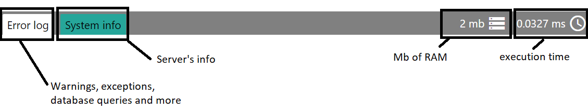
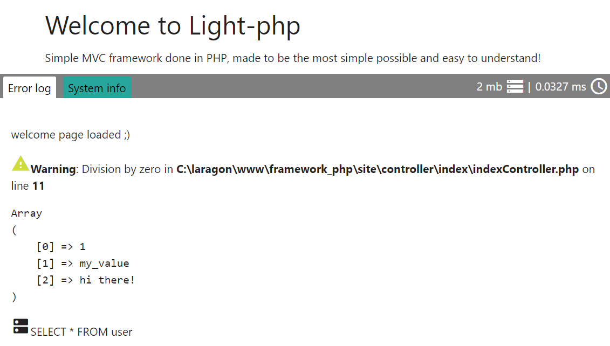
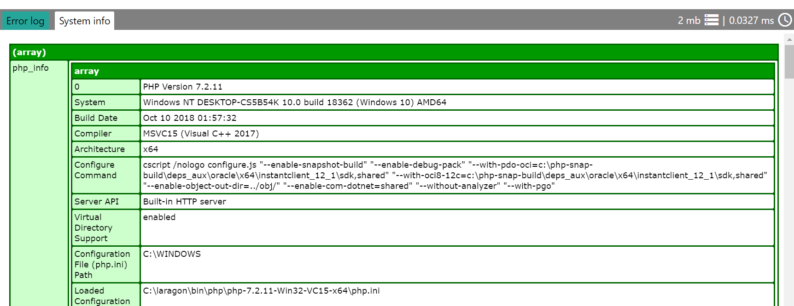

<style module>
	.debug_img {
		height: 300px;
        margin-top: 10px;
        box-shadow: 0 2px 2px rgba(0,0,0,.2);
	}
    .shadow_img{
        margin-top: 20px;
        box-shadow: 0 2px 2px rgba(0,0,0,.2);
    }
</style>

# Debug console  
Light's PHP debug console is a tool designed for debugging information and to solve errors and exceptions easily.  

This tool is divided in two tabs, one displays all the debug info produced after the main execution (collecting warnings, exceptions, database queries and custom messages!)  
The other tab, displays all the server info available (PHP version, php.ini file location, server timezone, created variables...)  

### Console tabs
  

### Debug tab    
Sample controller

``` php
    public function someFunction()
    {
        Console::addDebugInfo("welcome page loaded ;)");

        $cont = 5;
        $cont = $cont / 0; // Exception

        $list = array(1, "my_value", "hi there! ");
        Console::addDebugInfo($list);

        Database::query("SELECT * FROM user");

        Output::load("info/welcomeView");
    }
```
  

### Server info tab
Here we see all the server's info possible, we can check the PHP version, the path of php.ini file, and we have a scrollbar which display much more useful info!  


### Enabling debug console
For enabling this feature, we need to modify `config.php` file and set 'debug_console' to 'true' then the debug console will became available.


``` php
// Debug
Config::set("debug_console", true); // Set `true` for enabling debug console
Config::set("send_email_errors", false); 
Config::set("whoops", false);
Config::set("execution_time", microtime(true));
```  

